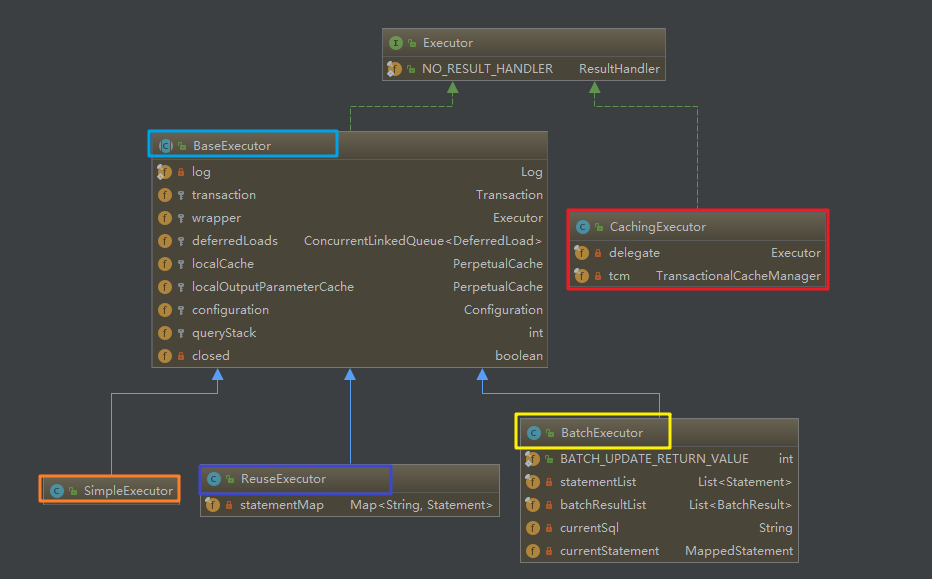

## 结构图
Executor 类型架构图


## 流程类
构建和获取 SqlSession 实例的流程：
-> 读取配置文件 -> SqlSessionFactoryBuilder.build -> DefaultSqlSessionFactory -> DefaultSqlSessionFactory.openSession -> new DefaultSqlSession

获取 Mapper 接口的流程：
-> SqlSession.getMapper -> Configuration.getMapper -> MapperRegistry.getMapper -> MapperProxyFactory.newInstance -> new MapperProxy -> Proxy.newProxyInstance

对应 Mapper 接口如何查到数据的流程：
(proxy) ->


## 基础类
判断指定的方法是否的 default 方法
```java
// org/apache/ibatis/binding/MapperProxy.java:96
if (!m.isDefault()) {
    return new PlainMethodInvoker(new MapperMethod(mapperInterface, method, sqlSession.getConfiguration()));
    }
```

